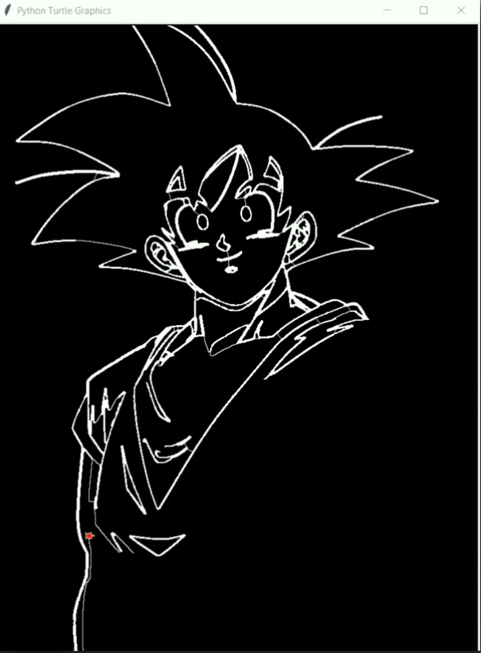
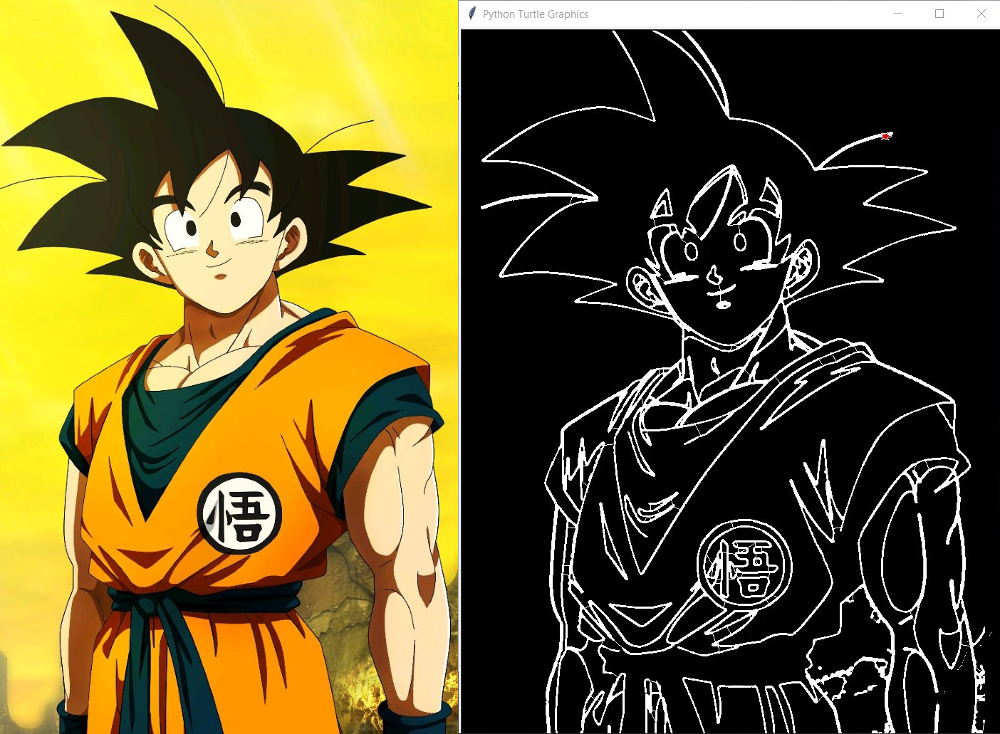

# Sketchy Turtle:turtle:

A turtle that (almost) sketches any image given to it.

---

  

---

### Directions to use:

1. Clone this repo: `git clone https://github.com/hrshtv/Sketchy-Turtle.git`
2. Run: `python3 sketch.py -in <input_img_path> -o <output_file_path> -wt <width> -ht <height>`
    - `-in` (`--input`) : The input image's path
    - `-o` (`--output`) : The output file's name. The output will be an  `.eps` file, provide only the name without any extensions
    - `-wt` (`--width`), `-ht` (`--height`) : Decides the shape `(width, height)` to which the input image will be resized to. This is also the canvas size on which the turtle will draw.

---

### Example:

---

### References:  

- [Auto Thresholding](http://www.kerrywong.com/2009/05/07/canny-edge-detection-auto-thresholding/)

---

### Improvements/To-do
- Try other autothresholding methods like the Otsu's method and compare the results
- Increase the efficiency of the sketching program
    - Currently some edges detected are very thick, which increases time taken unneccesarily, try edge thinning algorithms
    - While finding closest neighbours, omit the points that are too close to one another, to decrease the input size
    - [Ramer–Douglas–Peucker algorithm](https://en.wikipedia.org/wiki/Ramer%E2%80%93Douglas%E2%80%93Peucker_algorithm)

---

### Contributors:

- [hrshtv](https://github.com/hrshtv)
